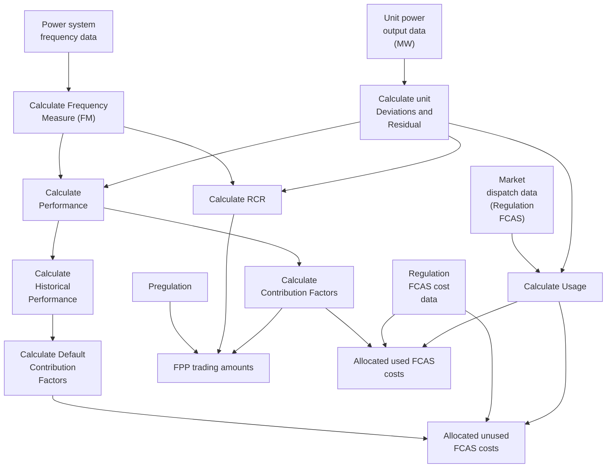

# Procedure for calculating Regulation FCAS costs

```mermaid
graph TD
    A["Power system<br/>frequency data"]
    B["Unit power<br/>output data<br/>(MW)"]
    C["Market<br/>dispatch data<br/>(Regulation<br/>FCAS)"]
    L["Regulation<br/>FCAS cost<br/>data"]

    D["Calculate Frequency<br/>Measure (FM)"]
    E["Calculate unit<br/>Deviations and<br/>Residual"]
    F["Calculate<br/>Performance"]
    G["Calculate<br/>Historical<br/>Performance"]
    H["Calculate RCR"]
    I["Calculate<br/>Contribution Factors"]
    J["Calculate Default<br/>Contribution<br/>Factors"]
    M["Calculate Usage"]

    K["Pregulation"]
    N["FPP trading amounts"]
    O["Allocated used FCAS<br/>costs"]
    P["Allocated unused<br/>FCAS costs"]

    A --> D
    B --> E
    C --> M
    D --> F
    D --> H
    E --> F
    F --> G
    F --> I
    G --> J
    I --> O
    J --> P
    K --> N
    L --> O
    L --> P
    M --> O
    M --> P
    H --> N
    E --> H
    E --> M
    I --> N

```